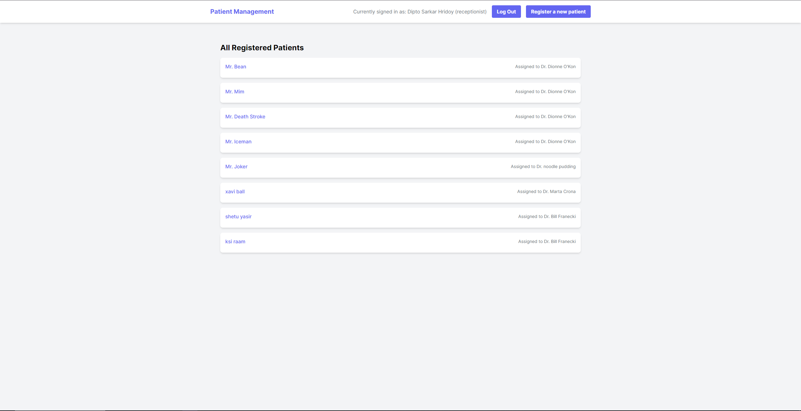
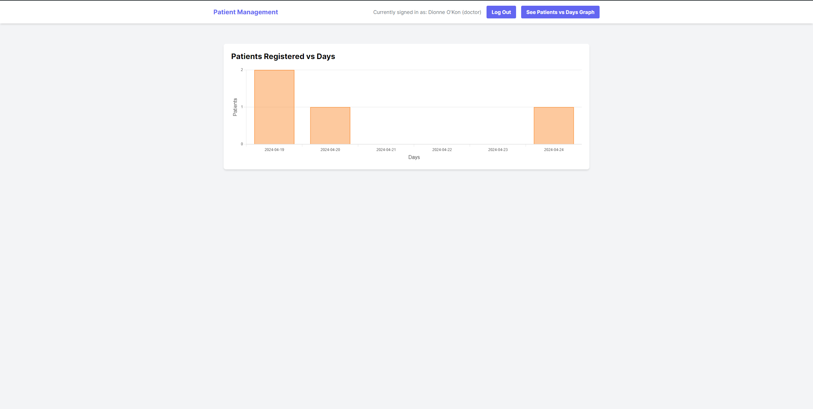

# Patient Management

## Introduction

This is a simple Rails application developed as a coding assessment for a Ruby on 
Rails developer position at [Makerble](https://about.makerble.com/). The application includes a receptionist portal and a doctor portal.

## Live Demo

You can see a live version of the app [here](https://patient-management-uioh.onrender.com).
Please note that the app is hosted on a free tier and may take a moment to load if it has been inactive.

## Features

- Single login page for both portals.
- Receptionists can register a new patient and perform CRUD operations.
- Doctors can view registered patients.
- Doctors can view a graph that represents the number of patients registered vs days.

## Screenshots

## Getting Started

These instructions will get you a copy of the project up and running on your local machine for development and testing purposes.

### Prerequisites

You need to have Ruby and Rails installed on your machine. See [this guide](https://guides.rubyonrails.org/getting_started.html#creating-a-new-rails-project-installing-rails) for instructions on setting up Rails.

### Installing

1. Clone the repository: `git clone https://github.com/DiptoSarkar182/patient_management`
2. Navigate into the project directory: `cd patient_management`
3. Install the dependencies: `bundle install`
4. Set up the database: `rails db:create db:migrate`
5. Start the server: `rails server`
6. Visit `http://localhost:3000/` in your browser to access the application.